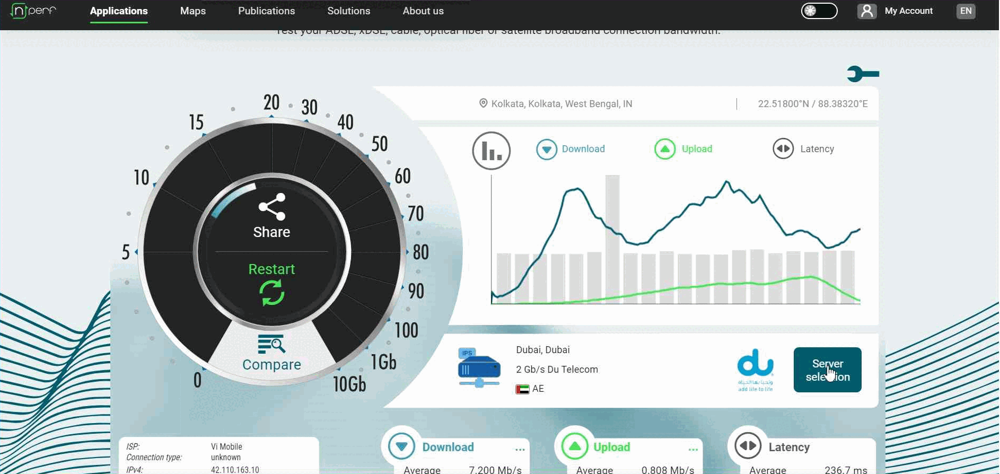

Document Name: Internet Speed Test Guideline

Document Version: 1.0

Open-Source Document

Release date: 22^nd^ July 2024

Author: Anjan Chandra

# Table of Contents {#table-of-contents .TOC-Heading}

[**1.** **Speed Test -- Cloudflare**
[2](#speed-test-cloudflare)](#speed-test-cloudflare)

[**2.** **Speed Test -- Google**
[3](#speed-test-google)](#speed-test-google)

[**3.** **Speed Test -- nPerf**
[4](#speed-test-nperf)](#speed-test-nperf)

[**3.1 nPerf Speed Test -- EMA / EU**
[5](#nperf-speed-test-ema-eu)](#nperf-speed-test-ema-eu)

[**3.2 nPerf Speed Test -- US**
[6](#nperf-speed-test-us)](#nperf-speed-test-us)

[**3.3 nPerf Speed Test -- ASPAC**
[6](#nperf-speed-test-aspac)](#nperf-speed-test-aspac)

[**4.** **AWS -- Latency Test**
[8](#aws-latency-test)](#aws-latency-test)

[**5.** **Azure -- Latency Test**
[9](#azure-latency-test)](#azure-latency-test)

[**6.** **Azure Download Test using PowerShell**
[10](#azure-download-test-using-powershell)](#azure-download-test-using-powershell)

## **Speed Test -- Cloudflare**

Perform Speed Test from Cloudflare ([Internet Speed Test - Measure
Network Performance \| Cloudflare](https://speed.cloudflare.com/)

Go to [Internet Speed Test - Measure Network Performance \|
Cloudflare](https://speed.cloudflare.com/) and click on Start / Restart

Take a capture full page.

{width="7.268055555555556in"
height="3.823076334208224in"}

## **Speed Test -- Google**

Perform Speed Test from Google ([Internet Speed Test \| Check Broadband
Speed \| Google Fiber](https://fiber.google.com/speedtest/))

Go to [Internet Speed Test \| Check Broadband Speed \| Google
Fiber](https://fiber.google.com/speedtest/) and click on GO

{width="7.2in"
height="3.612791994750656in"}

## **Speed Test -- nPerf**

Perform SpeedTest from nperf ([Internet Speed test : Test your broadband
connection (speedtest) - nPerf.com](https://www.nperf.com/en/))

{width="7.266831802274716in"
height="2.892308617672791in"}Go to [Internet Speed test : Test your
broadband connection (speedtest) - nPerf.com](https://www.nperf.com/en/)
and click on Start Test

You would get a result like below. Take a screenshot.

{width="7.268055555555556in"
height="4.097222222222222in"}

Additionally, you must choose 3 servers from 3 different regions (AMS,
EU, ASPAC) and run another 3 tests. You can choose alternative server if
the one you chose doesn't work for you.

Click over the Server Selection Option

### **3.1 nPerf Speed Test -- EMA / EU**

**Test for EU / Europe / Netherlands / Amsterdam or any other city**

Search "\[NL\]" and choose any of the available options from Netherlands
and run the test. If the server doesn't work for you then, repeat the
step and choose another option from Netherlands.

{width="7.268055555555556in"
height="3.3513888888888888in"}

### **3.2 nPerf Speed Test -- US** 

**Test for US / USA / Verizon**

Search "\[US\]" and choose any of the available options from Verizon and
run the test. If the server doesn't work for you then, repeat the step
and choose another option from USA.

{width="7.268055555555556in"
height="3.446527777777778in"}

### **3.3 nPerf Speed Test -- ASPAC** 

**Test for ASPAC / Singapore / DataPackets**

Search "\[SG\]" and choose any of the available options from Verizon and
run the test. If the server doesn't work for you then, repeat the step
and choose another option from USA.

{width="7.268055555555556in"
height="3.8in"}

## **AWS -- Latency Test**

AWS Latency Test - [AWS Latency Test
(awsspeedtest.com)](https://awsspeedtest.com/latency)

This tool runs latency test from your IP location to AWS datacenters
around the world.

{width="7.31961832895888in"
height="4.123076334208224in"}

## **Azure -- Latency Test**

Azure Latency Test - [Azure Latency Test - Measure Latency to Azure
Datacenters Worldwide
(azurespeed.com)](https://www.azurespeed.com/Azure/Latency)

Test latency from your IP location to Azure datacenters worldwide.

{width="7.268055555555556in"
height="3.846153762029746in"}

## **Azure Download Test using PowerShell**

Azure Download Test using PowerShell

Open powershell (Windows PowerShell ISE) and run the below script. Send
the report to intended participant. The script is going to create a file
name "azure_download_test.txt" and save to your download folder. The
script would also open a email prompt.

Open "Windows PowerShell ISE"

{width="3.0769225721784776in"
height="2.0600109361329833in"}

Run the below script in Windows PowerShell ISE

{width="7.268055555555556in"
height="1.94375in"}

The script would take few minutes to complete the download of Azure Blob
Files.

{width="7.268055555555556in"
height="2.484615048118985in"}

Once completed, the script would create a file named
"azure_download_test.txt" and open an email prompt.

{width="2.607638888888889in"
height="2.7847222222222223in"}

{width="7.414529746281715in"
height="2.4014260717410325in"}

{width="7.203601268591426in"
height="3.4218963254593175in"}
